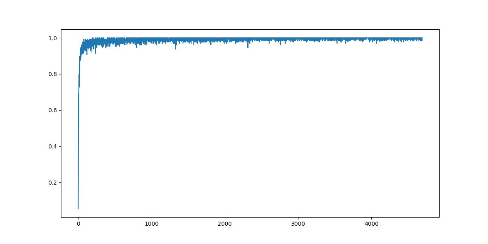

## Overview
This is an implementation of CNN-SVM architecture using pytorch,<br>
as a reproduction of the paper \<
An Architecture Combining Convolutional Neural Network and Support Vector Machine for Image Classification\>, Abien Fred M. Agarap, 2017. [paper link](https://arxiv.org/abs/1712.03541)<br><br>
To read my review on the paper(_written in Korean_), please follow the [link](https://mons2us.github.io/paper-reproduction/deeplearning/2020/10/28/cnn_svm.html) to my blog.

## Installation
```bash
$ git clone https://github.com/mons2us/paper_reproduction.git
$ cd <dir>/An Architecture Combining Convolutional Neural Network and Support Vector Machine for Image Classification
$ pip install -r requirements.txt
# This implementation was made under python 3.7
```

## Usage
```bash
usage: main.py [-h] [--mode MODE] [--loss_type LOSS_TYPE] [--data_type DATA_TYPE] [--batch_size N]
               [--epochs N] [--use_cuda] [--seed S] [--log_interval N] [--model_pth MODEL_PTH]
               [--plot_pth PLOT_PTH]

Architecture combining CNN and SVM on (Fashion) MNIST

optional arguments:
  -h, --help            show this help message and exit
  --mode MODE
  --loss_type LOSS_TYPE
                        Do you want to use softmax or svm as the loss function? (Default: Softmax)
  --data_type DATA_TYPE
                        Data type to train or test: MNIST or Fashion_MNIST available
  --batch_size N        Batch size to be used for training (default: 128)
  --epochs N            Number of epochs to be used for training (default: 10)
  --use_cuda            Whether to use cuda in training. If you don't want to use cuda, set this to False
  --seed S              Random seed (default: 2020)
  --log_interval N      Logging interval in training (default: 10)
  --model_pth MODEL_PTH
                        Path for the model to be saved or loaded from. Default is ./model; If using svm
                        loss, model will automatically be saved in ./model with name: model_cnn_svm.pkl
  --plot_pth PLOT_PTH   Path for the result plot to be saved at. Default is ./plot
```

For train,
```bash
$ python main.py --mode=train
                 --loss_type=svm
                 --data_type=MNIST
                 --batch_size=128
                 --use_cuda=True
                 --epochs=10
                 --model_pth="./dir/to/save/model"
                 --plot_pth="./dir/to/save/plots"
```

For test,
```bash
$ python main.py --mode=test
                 --loss_type=softmax
                 --data_type=MNIST
                 --model_pth="./path/to/your/model" 
```

## Result
If you specified your directory to save plots, you can see plots as below saved after your training has finished;
<br>

When using 'mode=test' argument, test accuracy for the selected dataset will be printed out as;
```bash
$ python main.py --mode=test --loss_type=softmax --data_type=Fashion_MNIST             
Test Accuracy: 0.9125
```

