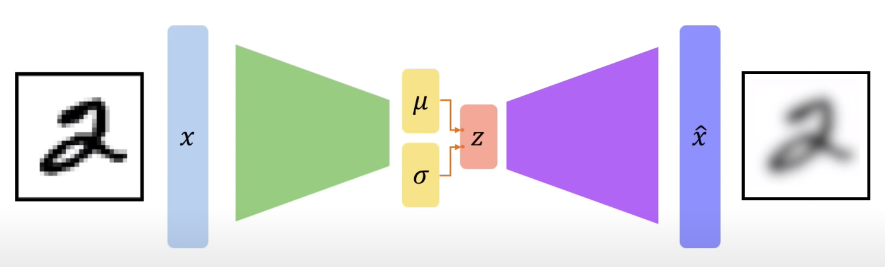
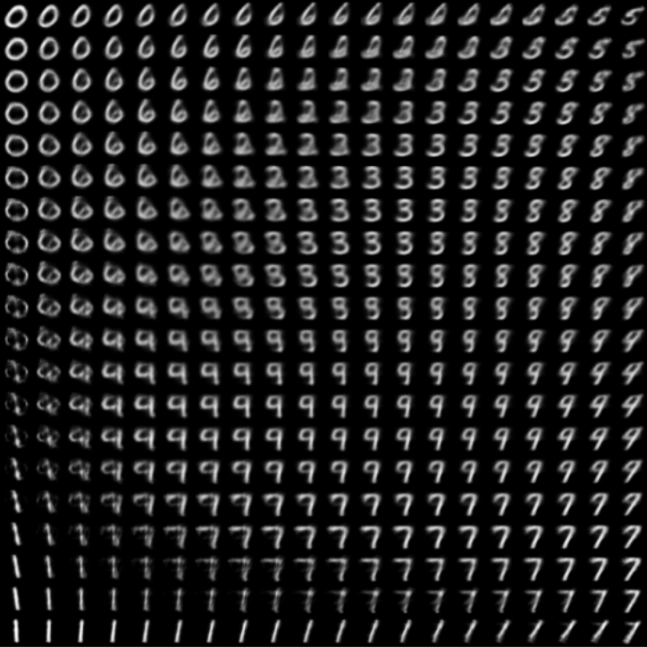

## Overview
This is an implementation of VAE using pytorch,<br>
as a reproduction of the paper \<Auto-Encoding Variational Bayes\>, Diederik P Kingma et al., 2013. [paper link](https://arxiv.org/abs/1312.6114)<br><br>
<br><br>
To read my review on the paper(_written in Korean_), please follow the [link](https://mons2us.github.io/paper-reproduction/deeplearning/2020/10/10/vae.html) to my blog.

## Installation
```bash
$ git clone https://github.com/mons2us/paper_reproduction.git
$ cd <dir>/paper_reproduction/Autoencoding-Variational-Bayes
$ pip install -r requirements.txt
# This implementation was made under python 3.7
```

## Usage
```bash
usage: main.py [-h] [--mode MODE] [--batch_size N] [--epochs N]
               [--latent_dims N] [--use_cuda] [--seed S] [--log_interval N]
               [--model_pth MODEL_PTH]

Variational Autoencoder on MNIST

optional arguments:
  -h, --help            show this help message and exit
  --mode MODE
  --batch_size N        Batch size to be used for training (default: 64)
  --epochs N            Number of epochs to be used for training (default: 10)
  --latent_dims N       Size of VAE's latent dimension (default: 20)
  --use_cuda            Whether to use cuda in training. If you don't want to
                        use cuda, set this to False
  --seed S              Random seed (default: 2020)
  --log_interval N      Logging interval in training (default: 10)
  --model_pth MODEL_PTH
                        Path for the model to be saved or loaded from
```

For train,
```bash
$ python main.py --mode=train \
                 --batch_size=64 \
                 --epochs=10 \
                 --latent_dims=20 \
                 --use_cuda=True \
                 --model_pth='/your/directory/to/model.pkl'
```

For test,
```bash
$ python main.py --mode=test \
                 --model_pth='/your/directory/to/model.pkl'
```

## Visualization (Result)
Running
```bash
$ python main.py --mode=visualize \
                 --model_pth='/your/directory/to/model.pkl'
```
will give you plots as below;<br>

