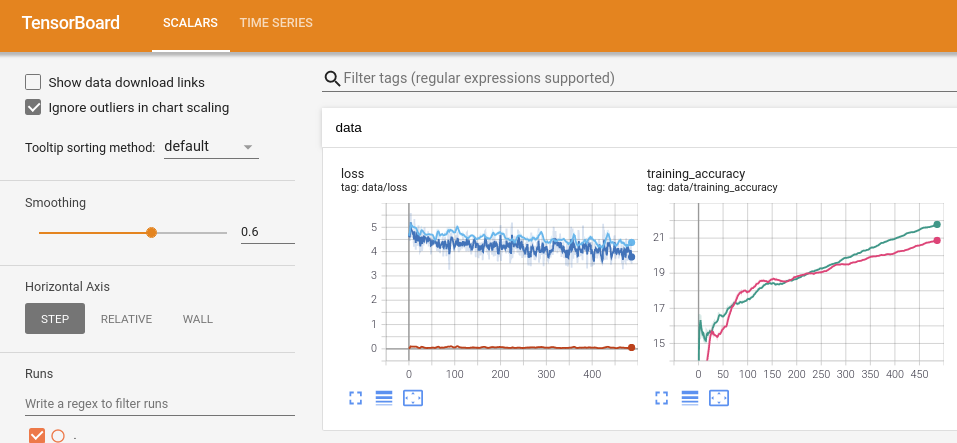

## Overview
This is an implementation of deep co-training using pytorch,<br>
as a reproduction of the paper \<Deep Co-Training for Semi-Supervised Image Recognition\>, Siyuan Qiao et al., 2018. [paper link](https://openaccess.thecvf.com/content_ECCV_2018/papers/Siyuan_Qiao_Deep_Co-Training_for_ECCV_2018_paper.pdf)<br>
This code refers to AlanChou's PyTorch implementation [link](https://github.com/AlanChou/Deep-Co-Training-for-Semi-Supervised-Image-Recognition)<br><br>
To read my review on the paper(_written in Korean_), please follow the [link](https://mons2us.github.io/paper-reproduction/deeplearning/2020/12/26/deep_cotraining.html) to my blog.

## Installation
```bash
$ git clone https://github.com/mons2us/paper_reproduction.git
$ cd {dir}/Deep-cotraining
# This implementation was made under python 3.7.7
```

## Usage
```bash
usage: main.py [-h] [--batchsize BATCHSIZE] [--lambda_cot_max LAMBDA_COT_MAX]
               [--lambda_diff_max LAMBDA_DIFF_MAX] [--seed SEED]
               [--epochs EPOCHS] [--warm_up WARM_UP] [--momentum MOMENTUM]
               [--decay DECAY] [--epsilon EPSILON] [--num_class NUM_CLASS]
               [--dataset_dir DATASET_DIR] [--config_dir CONFIG_DIR]
               [--tensorboard_dir TENSORBOARD_DIR]
               [--checkpoint_dir CHECKPOINT_DIR] [--base_lr BASE_LR]
               [--resume] [--data_type DATA_TYPE]
```

For training from beginning,
```bash
$ python main.py
```

For resume training from your last checkpoint,
```bash
$ python main.py --resume
```

During your training, you can execute tensorboard using;
```python
!tensorboard --logdir=./tensorboard/
```
